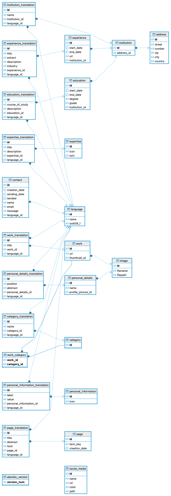

# Database Layer

This directory contains both the communication with the database and the definition of the database schema. All database-related logic and structure are implemented within its subfolders.

## Structure

The management of the database is divided into three main parts:

- **alembic/** – Contains migration scripts for handling schema changes.
  
- **models/** – Contains the definitions of all database models.
  
- **queries/** – Contains database access logic and parts of the business logic.

This separation ensures clear responsibilities, good maintainability, and makes it easier to replace or extend individual parts of the database layer.

## Database Schema

